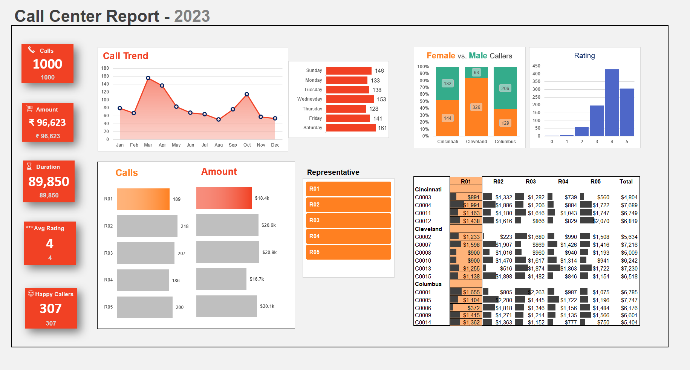
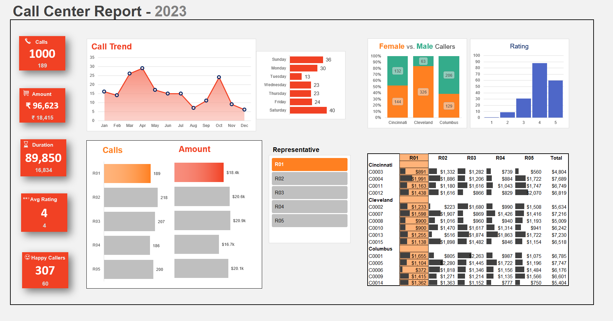

# 📞 Call Center Dashboard (Excel Project)

## 🔹 Project Overview
This project is an **interactive Excel dashboard** built using **Call Center performance data**.  
The dashboard helps track and analyze customer satisfaction, call volume, and representative performance.  

A key feature is the **Representative Slicer** – selecting one of the five representatives instantly updates the entire dashboard to show only that rep’s performance metrics.  

---

## 🔹 Dashboard Preview
📊 **Overall Dashboard with Slicer**  

🔄 **Example: Selecting Representative 1**  

---

## 🔹 Features
- 🎚️ **Interactive Slicer** → Filter by representative (5 in total)  
- 📈 **KPIs** → Total Calls, Handling Time, Customer Satisfaction Score  
- 📊 **Charts & Visuals** →  
  - Trend of calls over time  
  - Customer satisfaction by rep  
  - Call resolution rate  
- 📑 **Pivot Tables & Conditional Formatting** → Highlight performance issues  

---

## 🔹 Process
1. **Data Cleaning** – Removed blanks, standardized column names  
2. **Analysis** – Created pivot tables for KPIs and grouped metrics  
3. **Visualization** – Built charts and applied conditional formatting  
4. **Dashboard Design** – Added slicer to dynamically update all visuals  

---

## 🔹 Key Insights
- ⭐ Representative C has the **highest customer satisfaction** score  
- ⏱️ Representative D spends **more average time per call**, impacting efficiency  
- 📉 Call volume dips significantly on weekends  

---

## 🔹 How to Use
1. Download the Excel file from the [`dashboard/`](Dashboard/) folder  
2. Open in Excel (desktop version recommended)  
3. Use the **Representative Slicer** to view individual performance dashboards  

---

## 🔹 Tools Used
  
  
  

---

✨ This project highlights my skills in **Excel dashboarding, interactivity, and data analysis for business decision-making**.  
